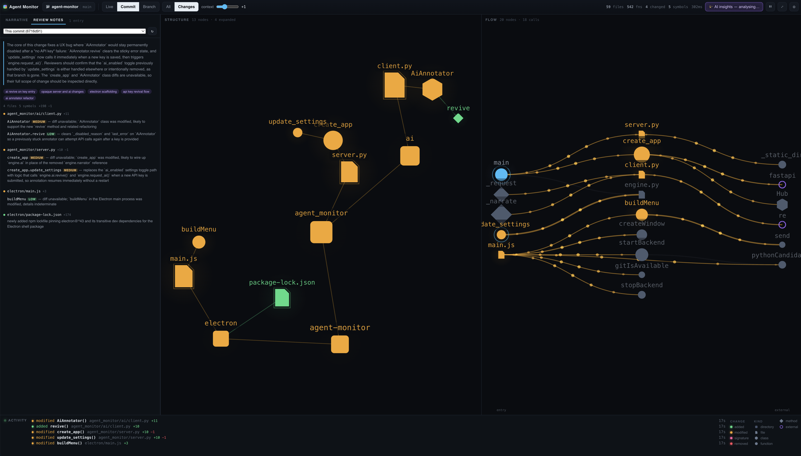

# Agent Monitor

[](docs/screenshot.png)

Watch an AI agent reshape your codebase, live.

Reviewing what an agent did is hard: a dozen files change per turn, and a
unified diff shows you *text*, not *shape*. Agent Monitor runs in a window
beside your agent's terminal and answers the question a diff can't — **what part
of the system did this touch?**

Three panes, updating as the agent works:

- **Narrative / Review notes** — two tabs. *Narrative* is a streamed, running
  commentary on what the agent is doing; *Review notes* compiles everything the
  AI has said about a change into one file-by-file list, for either your
  uncommitted work or this branch against another one you pick. (Optional; both
  need an API key.)
- **Structure** — repository → directories → files → classes → functions, as a
  force-directed graph. Changed things light up and pulse.
- **Flow** — the static call graph. Entry points on the left, fanning right
  through your functions into external packages.

You can also point it at uncommitted changes, a specific commit, or a branch, to
review the shape of a change before opening a PR.

---

## Install

**macOS app** — the easiest path: grab the signed, notarized DMG from the
[latest release](https://github.com/sibblegp/agent-monitor/releases/latest).
Nothing else to install.

**From source** — requires Python 3.10+ and `git`.

```bash
python -m venv env_cv
env_cv/bin/pip install -e '.[all]'
```

`[all]` pulls in the optional extras: `tree-sitter` for JavaScript/TypeScript
analysis, and `anthropic` for the optional AI annotations. Install just
`pip install -e .` if you only care about Python and want no AI dependency.

## Run

The easy way:

```bash
./run.sh                  # native window, watching this repo
./run.sh ~/code/project   # native window, watching that repo
./run.sh --browser        # browser instead of the native window
```

It finds the project venv, prefers the Electron shell, and falls back to the
browser automatically if Electron isn't installed.

Or run either flavour directly:

**Native window** — Electron shell, native folder picker, real window that
tiles properly:

```bash
cd electron && npm install && npm start
```

If `electron` is already installed globally, `electron .` works without the
`npm install`.

**Browser** — no Node required, works over SSH:

```bash
python -m agent_monitor            # opens the picker
python -m agent_monitor ~/code/my-project
```

Either way the app starts on an **Open** dialog if you don't name a path.
`Ctrl+O` reopens it, and recent repositories are remembered.

## Build a standalone macOS app

```bash
./packaging/build-macos.sh
```

Produces `dist-app/Agent Monitor-0.1.0-arm64.dmg` — no Python, no Node, nothing
to install. Must be run **on macOS**: PyInstaller freezes the interpreter it is
running under, so it cannot cross-compile, and an Apple Silicon Mac yields an
arm64-only app.

How it fits together: PyInstaller freezes the backend into a self-contained
`agent-monitor-backend`, electron-builder ships that inside the bundle as a
resource, and the shell spawns it instead of looking for a system Python. In a
source checkout the same shell falls back to `env_cv/bin/python`, so `npm start`
still works unchanged.

`git` remains a runtime requirement — it cannot be bundled, and the app checks
for it at launch and says so rather than opening a window that analyses nothing.

**Signing.** An unsigned build runs fine but Gatekeeper blocks the first launch;
right-click → Open, or `xattr -dr com.apple.quarantine "/Applications/Agent
Monitor.app"`. To sign and notarize properly you need an Apple Developer
account: export `CSC_NAME`, `APPLE_ID`, `APPLE_APP_SPECIFIC_PASSWORD`, and
`APPLE_TEAM_ID`, then run `./packaging/build-macos.sh --signed`. The hardened
runtime entitlements this needs are in `packaging/entitlements.mac.plist`.

## Try it without an agent

```bash
python tools/simulate_agent.py /tmp/demo-repo
```

That seeds a small Python + JavaScript repo, then walks it through a scripted
series of edits — a body change, a signature change, a new class, a
reformat-only pass, and a deletion — pausing between each so you can watch every
state animate.

---

## What it actually detects

The interesting part isn't "this file changed", it's **which symbol changed and
how**:

| State | Meaning |
|---|---|
| `added` | New function, method, or class |
| `modified` | Body semantics differ |
| `signature_changed` | Parameters, return type, or decorators differ — the API-breaking one |
| `removed` | Gone (kept on screen as a dim ghost, so you can see what was deleted) |
| `moved` | Same code, different line — **deliberately not shown as a change** |

Symbol identity is a hash of the **AST**, not the source text. So reformatting,
reindenting, or editing comments produces *no* changes at all — a `black` run
won't light up the whole graph. Editing a docstring does count, because a
docstring is a real AST node.

Directories report that their *contents* changed rather than inheriting their
loudest child's status, so one new function doesn't make the whole repository
read as "added".

### Languages

| Language | Support |
|---|---|
| Python | Full — symbols, imports, call graph, entry points (stdlib `ast`, no dependency) |
| JavaScript / TypeScript / JSX / TSX | Full — via `tree-sitter` (optional extra) |
| Everything else | File-level nodes with add/modify/delete status |

Nothing is invisible: an unsupported language still appears in the graph, just
without its internals.

### Call graph

Resolution is deliberately conservative — an edge is only drawn when a concrete
target can be named. `self.method()` resolves through in-repo base classes,
imports are followed to real modules, and anything unresolvable collapses into a
single `ext:<package>` node so your external surface stays visible without a
thousand leaf nodes.

Entry points anchor the left edge: `main`, `if __name__ == "__main__"` targets,
route/command decorators, `test_*`, and uncalled module-level functions.

---

## Reading the picture

Each node kind has its own silhouette, so structure stays readable when colour
is busy carrying change status and you're zoomed too far out for labels:

```
▢  directory      ⬡  class       ●  function
🗎  file           ◆  method      ○  external package (hollow)
```

Colour carries change status — emerald added, amber modified, pink signature
changed, crimson removed, violet external, cyan entry point.

**Motion means work is happening.** Only the *latest* change animates; earlier
changes stay identified by colour alone. When a change lands and you aren't
interacting, both panes glide to frame it and the rest of the graph dims
briefly. When nothing is changing, the app renders zero frames.

In the **Changes** view the changed subgraph keeps its call-flow particles
running continuously, since that subgraph is the entire subject.

**Changes means only changes.** The structure pane shows what actually changed
plus the directories and files holding it — nothing else. Call context is a
flow-pane concern, so the **context** slider widens the flow pane by that many
call hops around each change (0 = changed only), recomputed as you drag it.

### Controls

| Key | Action |
|---|---|
| `Ctrl/Cmd+O` | Open repository |
| `space` | Pause / resume live updates |
| `a` | Toggle All ⇄ Changes |
| `f` | Fit to view |
| `/` | Search symbols and files |
| `esc` | Clear focus |

Click a file to expand it into its symbols. Click any symbol to highlight it in
**both** panes at once — the fastest way to answer "where does this live, and
what does it call?". Hovering highlights without explaining: what a change *is*
belongs in the Review notes tab, not in a box chasing the cursor.

---

## Optional AI insights

**On by default, but inert without a key** — nothing is sent until you add an
Anthropic API key in Settings. Once you do, Agent Monitor annotates each
changeset with:

- a one-line summary per changed symbol, listed in the **Review notes** tab,
- a risk level and reason,
- named themes over the changeset, drawn as labelled hulls behind their members,
- a copyable review note for the whole diff, plus the **Review notes** tab: the
  same annotations gathered per file with risk badges, comparing either the
  working tree or this branch against a branch you choose,
- and a running commentary in the **Narrative** pane on the left, streamed as
  it's written: a play-by-play of what the agent appears to be doing, where each
  entry describes only what changed since the last one.

One batched request per changeset — never one per symbol — with results cached
per `(symbol, body hash)` so a symbol is analysed once no matter how much churns
around it. There's a live token/cost meter and a per-session request cap.

The key is read from `ANTHROPIC_API_KEY`, or entered in Settings (optionally
saved to the config file at mode `0600`). It is never sent back to the frontend
— the UI only ever sees a masked hint. A failed AI call never degrades the
visualization; it's strictly additive. Turn it off with the toggle in the top
bar; that choice is remembered.

---

## Notes

- The server binds **loopback only** and is gated behind a token stored in your
  config directory, so another local process can't drive it or read your source
  through it. `--new-token` rolls it.
- Opening a subdirectory analyses only that subtree, while git commands still
  run against the repository root — so opening one package inside a large
  monorepo doesn't drag the whole thing into the graph.
- `.gitignore` is honoured by asking `git check-ignore` rather than
  reimplementing its semantics.
- Watching falls back to mtime polling if `watchdog` is unavailable.

## Layout

```
agent_monitor/
  gitutil.py            git CLI wrappers (subprocess, -z everywhere)
  engine.py             orchestrator: state, rescans, deltas
  watcher.py            debounced filesystem watching
  analysis/             python_parser (stdlib ast), ts_parser (tree-sitter)
  graph/                structure, flow, and symbol-level diff
  ai/                   optional Anthropic annotations
  static/               self-contained frontend — ES modules + Canvas, no build
electron/               native shell: spawn backend, window, menu, dialog
packaging/              PyInstaller spec + macOS app build
tools/simulate_agent.py scripted demo edits
```

The frontend has **no build step and no dependencies** — plain ES modules and
Canvas 2D, including the force and layered-DAG layouts. Edit a file under
`static/` and reload.

---

Built by **George Sibble**, who is available for contract and AI engineering
work.
